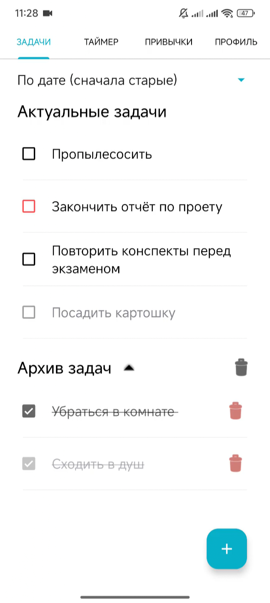
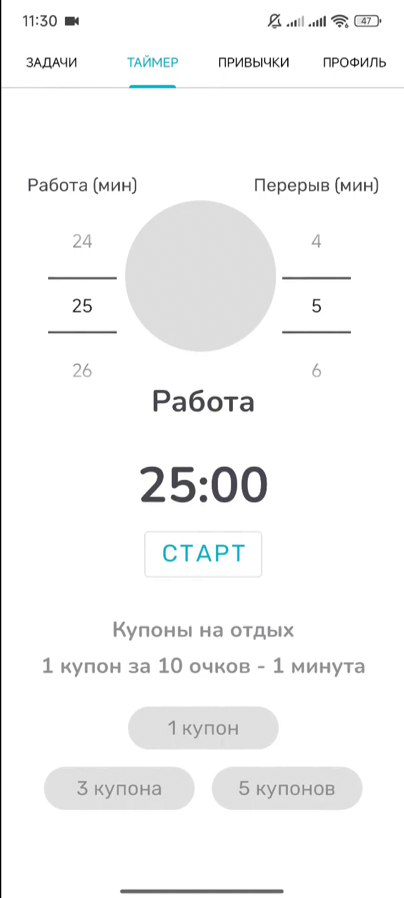
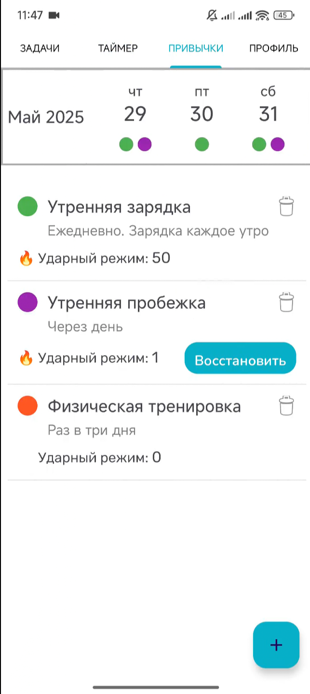

# Up - Приложение для борьбы с прокрастинацией


Приложение для повышения продуктивности с системой геймификации. Управляйте задачами, формируйте привычки и работайте по таймеру Pomodoro, получая очки за результаты.

---

## 🔥 Возможности

### 📝 Задачи
- Создание задач с приоритетами (низкий/средний/высокий)
- Архивирование и восстановление задач
- Сортировка по дате и приоритету

### ⏱ Таймер Pomodoro
- Гибкие настройки работы/отдыха
- Покупка "купонов отдыха" за очки
- Награды за выполненные циклы

### 🔄 Привычки
- Календарь с трекингом выполнения
- Ударный режим (streaks)
- Гибкая периодичность (день/неделя/месяц)

### 👤 Профиль
- Статистика
- Мотивационные сообщения
- История активности

---

## 🛠 Технологии
- **Язык**: Kotlin  
- **Backend**: Firebase (Auth, Firestore)  
- **Локальное хранилище**: SQLite  
- **Архитектура**: MVC с Repository Pattern
- **Библиотеки**: Coroutines, MPAndroidChart  

---

## 📸 Скриншоты
<div align="center">
  
  
  
</div>

---

## ⚙️ Установка
### Для разработчиков
1. Клонируйте репозиторий:
   ```bash
   git clone https://github.com/AglyamovRail/Up.git
Откройте проект в Android Studio:
File → Open → Выберите папку проекта
- Дождитесь завершения индексации и синхронизации Gradle
- Настройте Firebase:
- Добавьте файл google-services.json в папку app/
- Включите Firestore и Authentication в Firebase Console
- Запустите на эмуляторе:
- Выберите устройство в Android Studio
- Нажмите ▶ Run (Shift+F10)

📲 Установка APK
- Скачайте app-debug.apk
- На Android-устройстве:
- Перейдите в Настройки → Безопасность → Разрешить установку из неизвестных источников
- Откройте скачанный APK-файл
- Нажмите "Установить"

📊 Уникальные особенности
- Геймификация: Очки за все действия
- Гибкие привычки: Любая периодичность
- Адаптивный таймер: Покупка дополнительного отдыха
- Задачи с сортировкой и приоретизацией

📜 Лицензия
Этот проект распространяется под лицензией MIT.

<div align="center"> <i>Выпускная квалификационная работа © 2025</i> </div>
